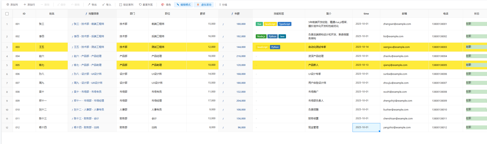
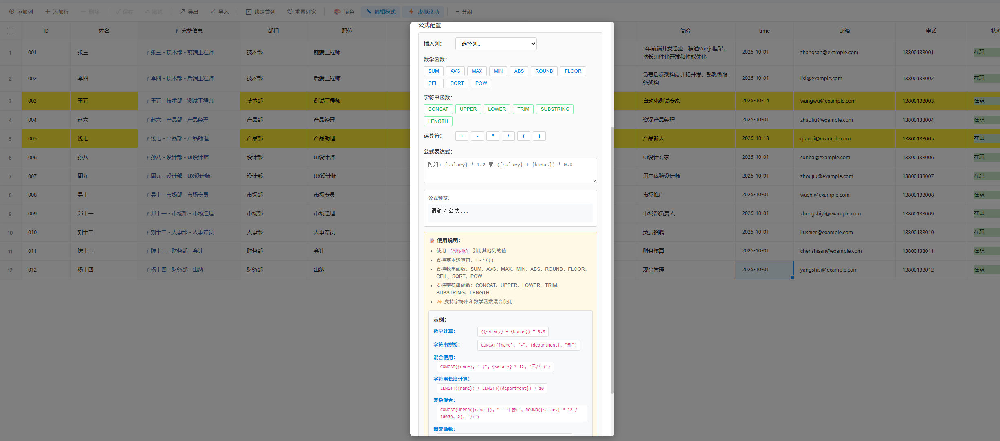

# 📊 Excel-like Table Component

一个功能强大的类 Excel 表格组件（仿钉钉的AI表格），基于 Vue 3 开发，提供丰富的数据编辑、可视化和管理功能。


## 📸 预览图

### 主界面 - 完整功能展示


### 编辑界面 - 多种列类型和条件格式


## ✨ 核心特性

### 📝 多种列类型支持
- **文本列** - 普通文本输入
- **数字列** - 数值输入，支持千分位格式化显示
- **日期列** - 日期选择器，自动格式化
- **下拉选择** - 单选下拉框，支持自定义选项和颜色
- **多选标签** - 多选标签，可视化展示
- **计算列** - 支持公式计算，实时更新

### 🧮 强大的计算功能

#### 数学函数
- `SUM()` - 求和
- `AVG()` - 平均值
- `MAX()` / `MIN()` - 最大/最小值
- `ABS()` - 绝对值
- `ROUND()` / `FLOOR()` / `CEIL()` - 四舍五入/向下/向上取整
- `SQRT()` - 平方根
- `POW(x, y)` - 幂运算

#### 字符串函数
- `CONCAT()` - 字符串拼接
- `UPPER()` / `LOWER()` - 大小写转换
- `TRIM()` - 去除首尾空格
- `SUBSTRING(str, start, length)` - 截取子串
- `LENGTH()` - 字符串长度

#### ✨ 混合使用
- 支持在同一公式中同时使用字符串函数和数学函数
- 支持函数嵌套和复杂表达式
- 智能类型转换，无缝衔接

#### 公式示例

**数学计算：**
```javascript
// 计算年薪
{ formula: '{salary} * 12' }

// 计算涨薪后的薪资
{ formula: '({salary} + {bonus}) * 1.2' }

// 使用数学函数
{ formula: 'ROUND({salary} * 1.15, 2)' }
```

**字符串操作：**
```javascript
// 拼接完整信息
{ formula: 'CONCAT({name}, " - ", {department}, " - ", {position})' }

// 转换大写
{ formula: 'UPPER({name})' }

// 截取前3个字符
{ formula: 'SUBSTRING({name}, 0, 3)' }
```

**✨ 混合使用（新功能）：**
```javascript
// 在字符串中嵌入计算结果
{ formula: 'CONCAT({name}, " (年薪:", {salary} * 12, "元)")' }

// 字符串长度参与数学计算
{ formula: 'LENGTH({name}) + LENGTH({department}) + 10' }

// 复杂混合：格式化输出
{ formula: 'CONCAT(UPPER({name}), " - 年薪: ", ROUND({salary} * 12 / 10000, 2), "万")' }

// 嵌套函数混合使用
{ formula: 'CONCAT("总长度:", LENGTH(CONCAT({name}, {department})))' }

// SUM 函数嵌套（逗号分隔）
{ formula: 'CONCAT({department}, " - 总计: ", SUM({salary}, {bonus}, 1000))' }

// SUM 函数嵌套（表达式）
{ formula: 'CONCAT({name}, " - 合计: ", SUM({salary} + {bonus}))' }
```

### 🎨 条件格式化
- 支持**单元格**或**整行**条件格式
- 丰富的条件操作符：
  - 等于/不等于
  - 包含/不包含
  - 大于/小于/大于等于/小于等于
  - 为空/不为空
- 智能识别列类型（日期、数字、文本）
- 自定义背景色和文字颜色

### 📊 数据操作

#### 编辑功能
- ✅ 单元格双击编辑
- ✅ 方向键快速导航（↑↓←→）
- ✅ Enter 进入/退出编辑
- ✅ Esc 取消编辑
- ✅ 拖动填充（智能递增）
- ✅ 修改标记和撤销

#### 行列操作
- ✅ 添加/删除行
- ✅ 批量选择删除
- ✅ 添加/编辑列配置
- ✅ 拖拽调整列顺序
- ✅ 拖拽调整列宽
- ✅ 拖拽调整行顺序
- ✅ 锁定首列

#### 数据管理
- ✅ 保存修改
- ✅ 撤销修改
- ✅ 导入 Excel/CSV
- ✅ 导出为 JSON
- ✅ 自动检测列类型

### 🚀 性能优化
- **虚拟滚动** - 支持大数据量渲染（万级数据流畅滚动）
- **按需渲染** - 只渲染可见区域
- **智能缓存** - 列宽等配置本地存储

### 📂 分组功能
- 按任意列分组
- 分组折叠/展开
- 分组内数据管理

### 🔒 编辑模式控制
- **编辑模式** - 完整的编辑功能
- **只读模式** - 仅查看，不可编辑

## 🎯 快速开始

### 安装依赖

```bash
npm install
```

### 基本使用

```vue
<template>
  <ExcelTable
    :data="tableData"
    :columns="columns"
    @save="handleSave"
    @export="handleExport"
  />
</template>

<script>
import ExcelTable from '@/components/ExcelTable/ExcelTable.vue'

export default {
  components: { ExcelTable },
  data() {
    return {
      // 列配置
      columns: [
        { 
          key: 'id', 
          label: 'ID', 
          type: 'text', 
          width: 80 
        },
        { 
          key: 'name', 
          label: '姓名', 
          type: 'text', 
          width: 120 
        },
        { 
          key: 'salary', 
          label: '薪资', 
          type: 'number', 
          width: 120 
        },
        { 
          key: 'joinDate', 
          label: '入职日期', 
          type: 'date', 
          width: 150 
        },
        { 
          key: 'status', 
          label: '状态', 
          type: 'select', 
          width: 100,
          options: [
            { label: '在职', value: '在职', color: '#c8e6c9' },
            { label: '离职', value: '离职', color: '#ffcdd2' }
          ]
        },
        { 
          key: 'skills', 
          label: '技能', 
          type: 'tags', 
          width: 200,
          options: [
            { label: 'Vue', value: 'vue', color: '#42b883' },
            { label: 'React', value: 'react', color: '#61dafb' }
          ]
        },
        { 
          key: 'annualSalary', 
          label: '年薪', 
          type: 'computed', 
          width: 130,
          formula: '{salary} * 12'
        }
      ],
      
      // 表格数据
      tableData: [
        {
          id: '001',
          name: '张三',
          salary: 15000,
          joinDate: '2023-01-15',
          status: '在职',
          skills: ['vue', 'react']
        }
      ]
    }
  },
  methods: {
    handleSave(data) {
      console.log('保存数据:', data)
      // 调用 API 保存数据
    },
    handleExport(data) {
      console.log('导出数据:', data)
      // 导出为 Excel 或 JSON
    }
  }
}
</script>
```

## 📖 详细文档

### 列配置 (Column Config)

| 属性 | 类型 | 说明 | 必填 |
|------|------|------|------|
| `key` | String | 列的唯一标识 | ✅ |
| `label` | String | 列的显示名称 | ✅ |
| `type` | String | 列类型：`text`/`number`/`date`/`select`/`tags`/`computed` | ✅ |
| `width` | Number | 列宽（像素） | ❌ |
| `options` | Array | 下拉/标签选项（type为select/tags时必填） | ❌ |
| `formula` | String | 计算公式（type为computed时必填） | ❌ |

### 选项配置 (Option Config)

用于 `select` 和 `tags` 类型的列：

```javascript
{
  label: '选项显示名称',
  value: '选项值',
  color: '#颜色代码'  // 背景颜色
}
```

### 事件 (Events)

| 事件名 | 参数 | 说明 |
|--------|------|------|
| `@save` | `data` | 保存按钮点击，返回当前数据 |
| `@export` | `data` | 导出按钮点击，返回当前数据 |
| `@add-column` | `columnConfig` | 添加新列 |
| `@update-column` | `columnConfig` | 更新列配置 |
| `@add-row` | `rowData` | 添加新行 |
| `@delete-row` | `rowData, index` | 删除行 |
| `@delete-rows` | `indices` | 批量删除行 |
| `@column-resize` | `{ columnKey, width, allColumnWidths }` | 列宽调整 |
| `@import` | `{ columns, data }` | 导入数据 |

## 🎨 使用技巧

### 1. 快捷键

- **编辑**
  - `双击` - 进入编辑模式
  - `Enter` - 进入/确认编辑
  - `Esc` - 取消编辑
  
- **导航**
  - `↑↓←→` - 移动选中单元格
  
- **填充**
  - 拖动单元格右下角小方块 - 快速填充数据

### 2. 拖拽操作

- **调整列宽** - 拖动表头右边缘
- **调整列顺序** - 拖动表头区域
- **调整行顺序** - 拖动行号左侧图标

### 3. 批量操作

- **批量选择** - 鼠标悬停行号，点击复选框
- **全选** - 点击表头的复选框
- **批量删除** - 选中后点击"删除"按钮

### 4. 条件格式

1. 点击工具栏的"填色"按钮
2. 配置条件规则：
   - 选择应用列
   - 选择条件（等于、大于、包含等）
   - 输入条件值
   - 设置颜色
3. 支持多个规则

### 5. 导入数据

1. 点击"导入"按钮
2. 选择 Excel 或 CSV 文件
3. 自动识别列类型和数据
4. 确认导入

## 🔧 高级配置

### 虚拟滚动

大数据量时启用虚拟滚动提升性能：

```javascript
// 组件内部已内置，默认开启
// 可通过工具栏按钮切换
```

### 列宽持久化

列宽调整会自动保存到 localStorage：

```javascript
// 重置列宽
点击工具栏的"重置列宽"按钮
```

### 分组显示

```javascript
// 启用分组
1. 点击工具栏"分组"按钮
2. 选择分组列
3. 数据自动按选定列分组
```

### 只读模式

```javascript
// 切换编辑/只读模式
点击工具栏的"编辑模式"/"只读模式"按钮
```

## 🎯 应用场景

✅ **人力资源管理** - 员工信息、薪资管理  
✅ **项目管理** - 任务列表、进度跟踪  
✅ **数据分析** - 数据录入、统计分析  
✅ **库存管理** - 商品管理、库存盘点  
✅ **财务管理** - 账单记录、费用统计  
✅ **CRM系统** - 客户信息、跟进记录  

## 🛠️ 技术栈

- **Vue 3** - 渐进式 JavaScript 框架
- **xlsx** - Excel 文件处理
- **原生 CSS** - 无需额外 UI 框架

## 📂 项目结构

```
table-com/
├── app/
│   ├── src/
│   │   ├── components/
│   │   │   └── ExcelTable/
│   │   │       ├── ExcelTable.vue          # 主组件
│   │   │       ├── excelTable.js           # 核心逻辑
│   │   │       ├── excelTable.css          # 样式文件
│   │   │       ├── AddColumnDialog.vue     # 添加列对话框
│   │   │       ├── ConditionalFormatDialog.vue  # 条件格式对话框
│   │   │       └── CellRenderers/         # 单元格渲染器
│   │   │           ├── TextCell.vue
│   │   │           ├── NumberCell.vue
│   │   │           ├── DateCell.vue
│   │   │           ├── SelectCell.vue
│   │   │           ├── TagsCell.vue
│   │   │           └── ComputedCell.vue
│   │   ├── views/
│   │   │   └── HomeView.vue               # 示例页面
│   │   └── main.js
│   └── package.json
└── README.md
```

## 🚀 开发

### 运行开发服务器

```bash
cd app
npm install
npm run serve
```

访问 http://localhost:8080

### 构建生产版本

```bash
npm run build
```

## 📝 更新日志

### v1.1.0 (2025-01-13)
- ✨ **新增** 计算列支持字符串函数和数学函数混合使用
- ✨ **新增** 条件格式支持日期类型智能比较
- ✨ **新增** 完整支持嵌套函数和括号（包括引号内的括号）
- 🐛 **修复** 拖拽调整列顺序后调整列宽导致顺序重置的问题
- 🐛 **修复** CONCAT 等函数无法正确处理包含括号的字符串参数
- 🐛 **修复** SUM/AVG 函数在嵌套使用时的括号匹配问题
- 🐛 **修复** 计算列编辑后公式未更新的问题
- 📝 **优化** 计算列公式编辑器，增加混合使用示例和嵌套函数示例

### v1.0.0 (2025-01-13)
- ✅ 初始版本发布
- ✅ 支持多种列类型（文本、数字、日期、下拉、标签、计算列）
- ✅ 计算列功能（数学函数、字符串函数）
- ✅ 条件格式化
- ✅ 虚拟滚动
- ✅ 导入导出
- ✅ 拖拽排序
- ✅ 批量操作

## 🤝 贡献

欢迎提交 Issue 和 Pull Request！

## 📄 License

[MIT License](LICENSE)

